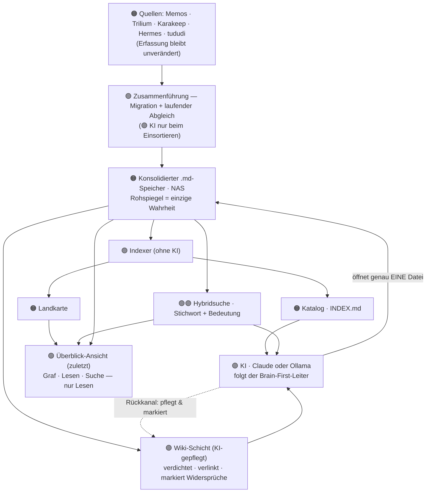

# Spezifikation — Second Brain ("der Vertrag")

> Verbindliche Grundlage der Umsetzung. Bei Streitfragen während des Bauens gilt, was hier
> steht — nicht die Erinnerung und nicht die Interpretation der KI. Änderungen an der
> Spezifikation werden bewusst und schriftlich vorgenommen.
>
> Status: freigegeben als Grundlage · werkzeug-agnostisch · Erstellt im Rahmen des
> Video-Prozesses (Schritt 3 von 6).

---

## 1. Zentrale Frage

Wie wird aus meinem über mehrere Tools verstreuten Wissen **ein einziger Ort, dem ich
vertrauen kann** — auffindbar und verlässlich — statt ein wachsender Müllhaufen?

Zwei Hälften: **Auffindbarkeit** (ich finde jede Information wieder, auch wenn ich nur noch
ungefähr weiß, worum es ging) und **Vertrauen** (Duplikate, Widersprüche und veraltete Stände
fallen auf, statt stillschweigend herumzuliegen).

## 2. Fähigkeiten (jede mit Fertigkriterium)

| # | Fähigkeit | Fertigkriterium (prüfbar) |
|---|-----------|---------------------------|
| **F1** | Finden ohne exaktes Wort (Bedeutungssuche) | Eine ungefähre Beispielfrage liefert die richtige Notiz in den Top-Treffern, ohne dass das exakte Wort im Text stehen muss. |
| **F2** | Lesen im selben System | Gefundenes lässt sich direkt öffnen und lesen, ohne die App zu wechseln. |
| **F3** | Sauber bleiben | Präparierte Notiz mit 3 eingebauten Widersprüchen → alle 3 werden markiert, eine harmlose Aussage wird eingearbeitet, **nichts wird überschrieben**. |
| **F4** | Überblick (Priorität: zuletzt) | Eine Karten-/Graf-Ansicht zeigt Cluster und Verbindungen, abgeleitet aus den Dateien. |

## 3. Nicht-Ziele

- Die KI entscheidet **nicht** selbst; sie markiert und schlägt vor — **ich entscheide**.
- Optik/Visualisierung kommt **zuletzt**; erst das Fundament (Finden + Vertrauen).
- *(Migration ist ausdrücklich KEIN Nicht-Ziel — sie ist gewünscht, siehe §6.)*

## 4. Randbedingungen / Prinzipien

- **Single Source of Truth:** EIN konsolidierter **`.md`-Speicher auf dem NAS** ist die einzige
  Wahrheit (roher Spiegel). Die Erfassungs-Tools sind nur Quellen/Zubringer.
- **Zweischichtige Ablage:**
  1. **Rohspiegel** — die Notizen als einfache `.md`-Dateien = die Wahrheit.
  2. **Wiki-Schicht** — darüber eine verdichtete, verlinkte Sicht, die die KI nach festen
     Regeln pflegt und in der sie Widersprüche markiert.
- **KI-/Rechen-Ort offen:** Online-KI-Dienst *oder* lokales Ollama. Datenschutz-Konsequenz je
  nach Wahl (bei einem Online-Dienst gehen bewusst ausgewählte Ausschnitte an den Dienst).
  Entscheidung im Werkzeug-Schritt.
- **Deterministisch, wo es geht:** normaler Code für alles Sture (Katalog, Landkarte,
  Quell-Abgleich); KI nur dort, wo wirklich Verstehen nötig ist (Such-Verständnis, Wiki-Pflege).
- **Abgeleitete Sichten sind wegwerfbar:** Katalog, Suchindex, Graf und Wiki lassen sich
  jederzeit neu bauen — kein Wissensverlust, weil der Rohspiegel die Wahrheit hält.
- **Brain-First-Reihenfolge (Suchleiter):** Katalog → Wiki → Bedeutungssuche → genau EINE
  Datei → Antwort. Kein blindes Durchsuchen ganzer Ordner.
- **Wiki-Muster:** Die KI pflegt die Wiki-Schicht nach festen Regeln, verlinkt Seiten und
  markiert Widersprüche, statt sie zu überschreiben. Der Mensch entscheidet, welcher Stand gilt.

## 5. Architektur (funktionale Bausteine & Datenfluss)

Farb-/Rollen-Legende (zentrale Designidee aus dem Video — *so wenig KI wie möglich*):
🟠 **Daten** (deine Notizen) · 🟢 **Deterministischer Code** (läuft immer gleich, schnell,
kostenlos) · 🟣 **KI** (nur wo Verstehen nötig ist).

**Die 5 Bausteine (werkzeug-agnostisch):**

| # | Baustein | Rolle | Aufgabe |
|---|----------|-------|---------|
| 1 | Konsolidierter `.md`-Speicher (NAS) | 🟠 | Rohspiegel aller Notizen = einzige Wahrheit; enthält auch den Wiki-Ordner. Zufluss = die Zusammenführung (Migration + Abgleich). |
| 2 | Indexer | 🟢 | Scannt den Speicher, schreibt Katalog (INDEX.md) + Landkarte. Ohne KI → schnell, gleich, kostenlos. |
| 3 | Hybridsuche | 🟢🟣 | Stichwort (🟢) + Bedeutung (🟣, kleine Modelle) → Finden ohne exaktes Wort. |
| 4 | KI + Brain-First-Regelwerk | 🟣 | Beantwortet Fragen über die Suchleiter; pflegt als Rückkanal die Wiki-Schicht (markiert Widersprüche, überschreibt nie). |
| 5 | Überblick-Ansicht | 🟢 | Liest die Landkarte, zeigt den Graf, öffnet Dateien, bietet Suche. Nur Lesen. Kommt zuletzt. |

**Brain-First-Leiter (Baustein 4):** Katalog → Wiki → Bedeutungssuche → genau EINE Datei → Antwort.

**Wo die Fähigkeiten wohnen:** F1 → Hybridsuche (+Katalog) · F2 → KI/Ansicht öffnet EINE Datei ·
F3 → Wiki-Schicht (Ingest + Widerspruchs-Markierung) · F4 → Überblick-Ansicht.

**Kernentscheidung:** KI (🟣) steckt nur an zwei Stellen — im Bedeutungs-Anteil der Suche und
in der KI/Wiki-Pflege. Alles andere ist deterministischer Code → günstig, schnell,
reproduzierbar. Alle abgeleiteten Sichten (Katalog, Landkarte, Suchindex, Wiki, Ansicht) sind
jederzeit neu baubar; nur der Rohspiegel ist die Wahrheit.

**Konkretisierung aus dem Video (Struktur-Anregung, werkzeug-neutral):**
- **Artefakt-Namen:** Katalog = `INDEX.md` (wird als Erstes gelesen); Landkarte = z. B. `graph.json`.
- **Ordnerkonvention:** nummerierte Workflow-Ordner (z. B. `00–09`: Inbox, Daily, Vorlagen …) +
  Themencluster (z. B. `10–60`); dazu ein **ausschließlich KI-gepflegter Wiki-Ordner**
  (im Video „09 Wiki") — den fasst der Mensch nicht an.
- **Workspace ≠ nur Notizen:** er kann auch Code-Projekte, Skills, Memory und Connectors
  umfassen; die Überblick-Ansicht (Baustein 5) zeigt später das *ganze* System, nicht nur die Notizen.

**Indexer-Details (Baustein 2):** erfasst je Datei drei Dinge — *Was?* (Titel · Ort · Größe),
*Wie verbunden?* (Links · Tags), *Cluster-Zugehörigkeit*. Schreibt zwei Ausgaben:
`graph.json` (Landkarte: jeder Punkt, jede Verbindung — füttert später die Graph-Ansicht) und
`INDEX.md` (Katalog: **eine Zeile pro Bereich/wichtiger Datei, nicht pro Notiz** — sonst wird
der Katalog selbst ein Buch). **Keine KI** → jeder Lauf exakt gleich, dauert Sekunden, kostet
nichts. Gebaut wird der Indexer im selben Mini-Prozess: Muster festlegen → Mini-Spec → bauen lassen.

**Wiki-Details (Baustein 4, Fähigkeit F3):**
- **Seitentypen:** Quellen-Seite, Themen-Seite, Entitäten-Seite (Person/Projekt), Synthese-Seite
  (verdichtet mehrere Quellen). Alles quervernetzt.
- **Ingest (wichtigster Vorgang):** KI liest die neue Quelle (Transkript/Artikel/Notiz), ermittelt
  über ein **Seitenverzeichnis nur die betroffenen Seiten** und öffnet ausschließlich diese (nicht
  das ganze Wiki). Dann: betroffene Seiten aktualisieren, fehlende neu anlegen, Verweise setzen —
  und auf jeder Seite **prüfen, ob die neue Information dem Bestand widerspricht**; Widersprüche
  werden **markiert, nie überschrieben** (der Mensch entscheidet, welcher Stand gilt).

## 6. Datenbasis & Zusammenführung

- **Quellen** (Erfassungs-Prozess bleibt unverändert): **Memos, Trilium, Karakeep, Hermes, tududi**.
- **Einmal-Migration** der Altbestände in den zentralen `.md`-Rohspiegel.
- **+ Laufender Abgleich**, um neue Notizen aus den Quellen nachzuziehen.
- Über dem Rohspiegel pflegt die KI die **Wiki-Schicht** (verdichten, verlinken, Widersprüche
  markieren).

## 7. Offene Entscheidungen (für den Werkzeug-Schritt, nach Plan-Freigabe)

- Konkrete **Hybridsuche** (welches Produkt).
- **KI-/Rechen-Ort:** Online-Dienst vs. lokales Ollama.
- **Export-/Abgleich-Wege** je Quell-Tool (API/Export für Memos, Trilium, Karakeep, Hermes, tududi).
- **Automatisierungsgrad** des laufenden Abgleichs (manuell angestoßen vs. zeitgesteuert).
- Endgültiger **NAS-Speicherort** des `.md`-Speichers.

---

*Der zugehörige Bauplan (Schritt 4, kleine testbare Aufgaben) liegt unter
`~/.claude/plans/ich-will-den-second-cached-micali.md`.*
